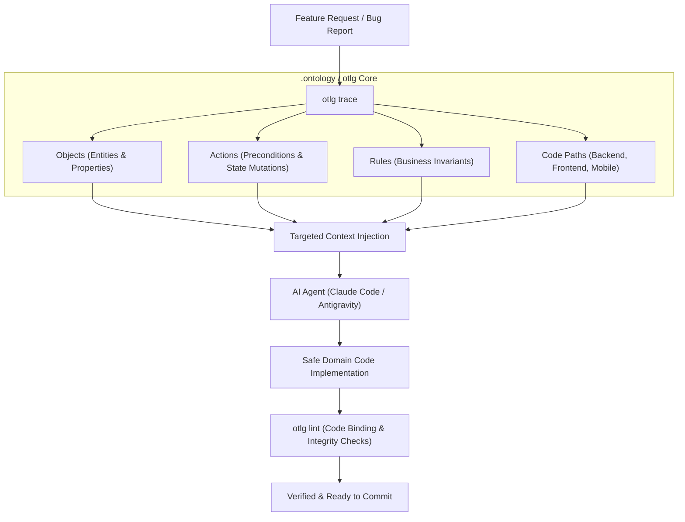

# repo-ontology (otlg)

[](README.md)
[](https://www.python.org/downloads/)
[](https://opensource.org/licenses/MIT)

> **"Restoring domain invariants and codebase maps to amnesiac agents in 10 seconds."**  
> An executable ontology framework & CLI porting Palantir Foundry / AIP primitives directly into Git codebases.

---

## Highlights

- **10-Second Context Restoration**: Instantly retrieve domain entities, preconditions, business invariants, and full-stack source paths with a single `otlg trace <query>` command.
- **Machine-Readable 4 Primitives**: Strictly defines Palantir AIP's **Objects** (nouns), **Links** (relations), **Actions** (state-mutating transactions), and **Functions** (computations) in YAML.
- **Drift Prevention via Static Analysis**: `otlg lint` validates declared fields, foreign key referential integrity, and ensures bound source file paths actually exist in the repository.
- **Spec-to-Code Translation Pipeline**: Ingests client requirement spreadsheets with `otlg intake`, and reverse-maps UI screens to backend domain entities using `otlg translate`.
- **Full-Stack Architecture Binding**: Seamlessly maps domain models across FastAPI (Clean Architecture), React (Feature-Sliced Design), and Flutter (MVVM).

---

## Why I Built This

When building complex software with AI coding agents (Claude Code, Antigravity, Cursor), the primary bottleneck is never the model's raw reasoning capacity—it is **context amnesia and domain invariant erosion**.

1. **Session Amnesia**: Every time a new session starts or an agent context resets, dozens of source files must be re-read. This burns context tokens while critical domain business rules and preconditions are easily forgotten or violated.
2. **Spec Drift in Markdown Docs**: Hand-written documentation in `docs/features/` drifts out of sync the moment code changes. There is no automated mechanism for a machine to verify if the markdown matches reality.
3. **Inherent Limitations of Database ERDs**: An ERD shows only static nouns (table structures and foreign keys). It is completely silent on valid state transitions (verbs/Actions), caller permissions, and transactional business guards.

To solve this, I ported the ontology philosophy of enterprise operational platforms (**Palantir Foundry / AIP**) into the Git repository workflow.

By declaring nouns (Objects), verbs (Actions), and business invariants (Rules) inside `.ontology/` as a machine-readable Single Source of Truth (SSOT), the `otlg` CLI enables instant context hydration and static integrity verification.

---

## Agent Workflow



---

## Real-World Terminal Output (`otlg trace`)

When a developer or agent inputs a feature query, `otlg` returns all required domain constraints and code paths in milliseconds:

```console
$ otlg trace attendance

# Ontology Trace: `attendance`
Matched Domains: education

## 📦 Affected Objects
- AssignmentSubmission (education): Student submission and grading status
  - Properties: id, course_id, student_id, status, score, feedback
- ClassSession (education): Scheduled class session and attendance tracking
  - Properties: id, course_id, session_date, start_time, end_time, status
- Course (education): Academic course unit created by instructor
  - Properties: id, title, instructor_id, status, max_students, created_at

## ⚡ Affected Actions
- GradeSubmission → AssignmentSubmission: Instructor grades submission
  - Precondition: target.status in ['SUBMITTED', 'RESUBMITTED']
  - Precondition: actor.id == target.course.instructor_id
- RecordAttendance → ClassSession: Record student attendance status
  - Precondition: target.status != 'CANCELLED'
  - Precondition: actor.id == target.course.instructor_id

## 🛡️ Relevant Rules & Invariants
- INSTRUCTOR_COURSE_OWNERSHIP: Instructors can only mutate own courses
- STUDENT_SUBMISSION_DEADLINE: Late submissions require flag or block

## 📂 Source Code Paths
- backend/app/models/assignment.py
- backend/app/models/class_session.py
- backend/app/services/attendance_service.py
- frontend/src/entities/attendance
- frontend/src/features/attendance-tracker
- mobile/lib/features/attendance/viewmodels/attendance_viewmodel.dart
```

---

## 4 Palantir Primitives

| Primitive | Directory | Description |
|:---|:---|:---|
| **Objects** (Nouns) | `.ontology/objects/*.yml` | Domain entities, properties, primary keys, and source code Model/Schema bindings |
| **Links** (Relations) | `.ontology/links/*.yml` | Cardinality (1:1, 1:N, N:M), foreign key mappings between entities |
| **Actions** (Verbs) | `.ontology/actions/*.yml` | State-mutating **atomic transactions**, preconditions, side effects, service bindings |
| **Functions** (Computations) | `.ontology/functions/*.yml` | Pure derived properties, calculations, and AIP LLM chain interfaces |

### Action Spec Example (`.ontology/actions/record_attendance.yml`)

Actions represent valid state mutations. They strictly define preconditions that must hold true before execution:

```yaml
action:
  name: RecordAttendance
  domain: education
  description: Instructor records or modifies attendance status in a class session.
  target_object: ClassSession
  actor: User
  preconditions:
    - expression: "target.status != 'CANCELLED'"
      message: "Cannot record attendance for cancelled sessions."
    - expression: "actor.id == target.course.instructor_id"
      message: "Only the assigned course instructor can record attendance."
  side_effects:
    - "Create or update AttendanceRecord entity"
    - "Evaluate ClassSession.attendance_completed flag"
  code_binding:
    backend:
      service: backend/app/services/attendance_service.py
      method: record_student_attendance
    frontend:
      feature: frontend/src/features/attendance-tracker
    mobile:
      viewmodel: mobile/lib/features/attendance/viewmodels/attendance_viewmodel.dart
```

---

## CLI Guide

```bash
# 1. Initialize .ontology template in target project
otlg init [target-path]

# 2. Statically verify ontology integrity & code bindings
otlg lint [target-path]

# 3. Trace domain rules, preconditions, and source paths by query
otlg trace <query> [target-path]

# 4. Display overview and primitive metrics
otlg info [target-path]

# 5. Scaffold new object or action specification
otlg scaffold object <name> --domain <domain>
otlg scaffold action <name> --domain <domain>

# 6. Map UI screen queries to ontology primitives
otlg translate <screen-query> [target-path]

# 7. Analyze client requirements spreadsheet impact
otlg intake <requirements-file> [target-path]
```

---

## Directory Layout (`.ontology/`)

```text
<project-root>/
├── .ontology/
│   ├── config.yml              # Project metadata & tech stack config
│   ├── objects/                # Domain entities (User, Course, Session)
│   ├── links/                  # Relationships (1:N, N:M foreign keys)
│   ├── actions/                # State transition mutations (RecordAttendance)
│   ├── functions/              # Pure calculations (CalculateAttendanceRate)
│   ├── rules/                  # Global domain invariants
│   └── views/                  # UI view & screen mappings (optional)
├── docs/                       # Architecture Decision Records (ADRs), tech debt
└── backend/ frontend/ mobile/  # Full-stack implementation source code
```

---

## Tech Stack & Principles

| Layer | Technology | Details |
|:---|:---|:---|
| **Language & Runtime** | Python 3.11+ | Modern type hints and fast CLI startup |
| **CLI & Terminal** | Typer, Rich | Ergonomic argument parsing & rich terminal UI |
| **Data Validation** | Pydantic v2, PyYAML | Schema enforcement for ontology primitives |
| **Integrity Linting** | AST & Path Resolution | Verifies YAML contracts against real codebase files |

### 3 Core Principles

1. **Single Source of Truth (SSOT)**: Maintain business rules and code architecture maps in `.ontology/` to permanently eliminate documentation drift.
2. **Action-First State Mutation**: Enforce state changes exclusively through atomic Actions with explicit preconditions, never raw unvalidated field mutations.
3. **Agent-Oriented Retrieval**: Enable AI agents to hydrate all relevant domain constraints and file paths in one fast CLI call (`otlg trace`).

---

## Installation & Quickstart

```bash
# Clone and install in editable mode
git clone https://github.com/tomato-vault/repo-ontology.git
cd repo-ontology
uv pip install -e .

# Verify installation
otlg --help
```

---

## Related Projects & Articles

- [`vault-ontology`](https://github.com/tomato-vault/vault-ontology): Dual-modelling research testing ontology effectiveness across 4,400+ Obsidian notes using RDF and Property Graphs.
- [Engineering Blog (tomato-vault.github.io)](https://tomato-vault.github.io): In-depth essays on agentic development, domain-driven architectures, and invariant preservation.
