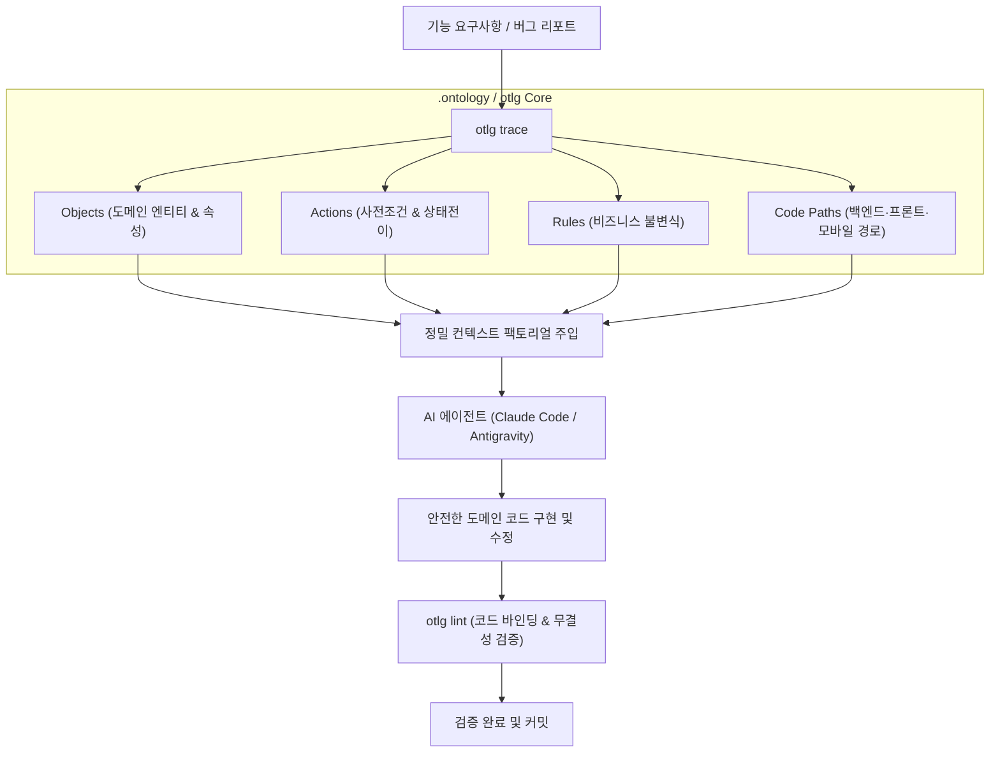

# repo-ontology (otlg)

[](README.en.md)
[](https://www.python.org/downloads/)
[](https://opensource.org/licenses/MIT)

> **"기억상실증 에이전트에 10초 만에 도메인 불변식과 코드 지도를 복원한다."**  
> Palantir Foundry / AIP의 온톨로지 프리미티브를 Git 코드베이스에 이식한 실행형 온톨로지 프레임워크 & CLI

---

## 하이라이트

- **10초 만의 컨텍스트 복원**: `otlg trace <query>` 하나로 연관 도메인 엔티티, 사전 조건(Preconditions), 비즈니스 불변식(Invariants), 풀스택 소스 경로를 즉시 추출
- **기계 가독형 4대 프리미티브**: 팔란티어 AIP의 **Objects**(명사), **Links**(관계), **Actions**(동사·트랜잭션), **Functions**(계산)를 YAML 규격으로 엄격 정의
- **문서-코드 드리프트 방지**: `otlg lint` 정적 분석기로 선언 필드, 외래키 참조 무결성, 실제 소스코드 파일 경로 실존 여부를 검사
- **기획-개발 번역 파이프라인**: `otlg intake`로 고객사 요구사항 문서를 분석하고, `otlg translate`로 UI 화면에서 백엔드 온톨로지를 역추적
- **풀스택 아키텍처 연계**: FastAPI(Clean Architecture) + React(FSD) + Flutter(MVVM) 전 계층 소스코드 바인딩 지원

---

## 왜 만들었나 (Why I Built This)

AI 에이전트(Claude Code, Antigravity, Cursor 등)를 활용한 실전 개발에서 겪은 가장 큰 병목은 모델의 추론 능력이 아니라 **컨텍스트의 소실과 도메인 불변식 파괴**였습니다.

1. **에이전트의 세션 기억상실증**: 새 세션이나 긴 작업 전환 시 매번 수십 개 소스 파일을 읽히며 컨텍스트 토큰을 낭비하고, 정작 중요한 도메인 제약조건을 놓칩니다.
2. **수기 마크다운 명세의 지속적 드리프트(Drift)**: `docs/features/`에 작성된 수기 문서는 코드가 수정되는 순간 거짓말이 되며, 기계가 검증할 방법이 없습니다.
3. **데이터베이스 ERD의 태생적 한계**: ERD는 명사(테이블 형태)만 보여줄 뿐, 시스템에서 허용되는 상태 전이(동사, Action)와 비즈니스 불변식(Rules)을 기계 가독형으로 통제하지 못합니다.

이 문제를 해결하기 위해 엔터프라이즈 데이터 운영 체계인 **팔란티어**(Palantir Foundry / AIP)의 온톨로지 철학을 코드베이스 레포지토리에 이식했습니다.

`.ontology/` 디렉터리에 명사(Objects)와 동사(Actions), 불변식(Rules)을 기계 가독형 단일 진실 공급원(SSOT)으로 선언하고, CLI 도구(`otlg`)로 정적 검증과 초고속 컨텍스트 복원을 자동화합니다.

---

## 에이전트 워크플로우



---

## 실전 터미널 출력 (`otlg trace`)

요구사항 키워드를 입력하면, 에이전트에게 필요한 모든 도메인 지식과 파일 경로가 구조화되어 즉시 반환됩니다.

```text
╭───────────────────────── Ontology Trace: attendance ─────────────────────────╮
│ # Ontology Trace: `attendance`                                               │
│                                                                              │
│ Matched Domains: education                                                   │
│                                                                              │
│ ## 📦 Affected Objects                                                       │
│ - AssignmentSubmission (education): 학생이 코스 과제에 제출한 답안 및 평가 상태│
│   - Properties: id, course_id, student_id, status, score, feedback           │
│ - ClassSession (education): 반(Class)의 특정 일자 수업 세션 및 출석 진행 상태│
│   - Properties: id, course_id, session_date, start_time, end_time, status    │
│ - Course (education): 강사가 개설하고 학생이 수강하는 교육 과정 단위         │
│   - Properties: id, title, instructor_id, status, max_students, created_at   │
│                                                                              │
│ ## ⚡ Affected Actions                                                       │
│ - GradeSubmission → AssignmentSubmission: 강사가 학생의 과제 제출물을        │
│   검토하고 점수와 피드백을 부여한다.                                         │
│   - Precondition: target.status in ['SUBMITTED', 'RESUBMITTED']              │
│   - Precondition: actor.id == target.course.instructor_id                    │
│ - RecordAttendance → ClassSession: 강사가 수업 세션에서 출석 상태를 기록     │
│   - Precondition: target.status != 'CANCELLED'                               │
│   - Precondition: actor.id == target.course.instructor_id                    │
│                                                                              │
│ ## 🛡️ Relevant Rules & Invariants                                            │
│ - INSTRUCTOR_COURSE_OWNERSHIP: 강사는 자신이 개설한 코스의 데이터만 수정     │
│ - STUDENT_SUBMISSION_DEADLINE: 마감 시각이 지난 과제는 지각 플래그 필수      │
│                                                                              │
│ ## 📂 Source Code Paths                                                      │
│ - backend/app/models/assignment.py                                           │
│ - backend/app/models/class_session.py                                        │
│ - backend/app/services/attendance_service.py                                 │
│ - frontend/src/entities/attendance                                           │
│ - frontend/src/features/attendance-tracker                                   │
│ - mobile/lib/features/attendance/viewmodels/attendance_viewmodel.dart        │
╰──────────────────────────────────────────────────────────────────────────────╯
```

---

## 4대 프리미티브 (Palantir Primitives)

| 프리미티브 | 파일 위치 | 역할 및 설명 |
|:---|:---|:---|
| **Objects** (명사) | `.ontology/objects/*.yml` | 도메인 엔티티, 속성, Primary Key, 소스코드 Model/Schema 바인딩 |
| **Links** (관계) | `.ontology/links/*.yml` | 엔티티 간 연관 관계, 카디널리티(1:1, 1:N, N:M), 외래키 매핑 |
| **Actions** (동사) | `.ontology/actions/*.yml` | 상태를 변경하는 **원자적 트랜잭션**, 실행 전 사전조건(`preconditions`), 부수효과, 서비스 코드 바인딩 |
| **Functions** (계산) | `.ontology/functions/*.yml` | 상태 변경 없는 순수 계산 로직 및 파생 속성 도출, AIP LLM 체인 |

### Action 스펙 예시 (`.ontology/actions/record_attendance.yml`)

동사는 시스템의 상태를 전이시키는 주체입니다. 실행 전 검증되어야 할 사전조건과 부수효과를 명시합니다.

```yaml
action:
  name: RecordAttendance
  domain: education
  description: 강사가 특정 수업 세션에서 학생의 출석 상태를 기록하거나 수정한다.
  target_object: ClassSession
  actor: User
  preconditions:
    - expression: "target.status != 'CANCELLED'"
      message: "취소된 세션에는 출석을 기록할 수 없습니다."
    - expression: "actor.id == target.course.instructor_id"
      message: "담당 강사만 출석을 기록할 수 있습니다."
  side_effects:
    - "AttendanceRecord 엔티티 생성 또는 업데이트"
    - "ClassSession.attendance_completed 플래그 검토"
  code_binding:
    backend:
      service: backend/app/services/attendance_service.py
      method: record_student_attendance
    frontend:
      feature: frontend/src/features/attendance-tracker
    mobile:
      viewmodel: mobile/lib/features/attendance/viewmodels/attendance_viewmodel.dart
```

---

## 핵심 명령어 (CLI Guide)

```bash
# 1. 대상 프로젝트에 .ontology 스켈레톤 안착
otlg init [target-path]

# 2. 온톨로지 무결성 및 실제 소스코드 바인딩 정적 검증
otlg lint [target-path]

# 3. 요구사항 키워드로 연관 도메인/불변식/코드 경로 즉시 역추적
otlg trace <query> [target-path]

# 4. 온톨로지 엔티티/액션 현황 요약
otlg info [target-path]

# 5. 새 객체/액션 스켈레톤 생성
otlg scaffold object <name> --domain <domain>
otlg scaffold action <name> --domain <domain>

# 6. UI 화면/기획서 명칭 기반 온톨로지 역매핑
otlg translate <screen-query> [target-path]

# 7. 고객사 요구사항 문서(스프레드시트) 온톨로지 영향도 분석
otlg intake <requirements-file> [target-path]
```

---

## 디렉터리 레이아웃 (`.ontology/`)

```text
<project-root>/
├── .ontology/
│   ├── config.yml              # 프로젝트 메타데이터 및 스택 설정
│   ├── objects/                # 도메인 엔티티 (User, Course, Session)
│   ├── links/                  # 엔티티 간 관계도 (1:N, N:M 외래키)
│   ├── actions/                # 상태 전이 액션 (GradeSubmission, RecordAttendance)
│   ├── functions/              # 순수 계산 및 도출 함수 (CalculateAttendanceRate)
│   ├── rules/                  # 전역 비즈니스 불변식 (Invariants)
│   └── views/                  # UI 화면/기획 스펙 매핑 (선택적)
├── docs/                       # 기술 부채, 아키텍처 결정(ADR)
└── backend/ frontend/ mobile/  # 실제 프로젝트 소스 코드
```

---

## 기술 스택 & 개발 원칙

| 구분 | 기술 / 원칙 | 상세 내용 |
|:---|:---|:---|
| **Language & Runtime** | Python 3.11+ | 현대적 타입 힌팅 및 고속 실행 |
| **CLI & Terminal** | Typer, Rich | 직관적인 인자 파싱 및 미려한 TUI 리포트 출력 |
| **Data Validation** | Pydantic v2, PyYAML | 엄격한 온톨로지 스키마 유효성 검증 |
| **Integrity Linting** | AST & Path Resolution | YAML 명세와 실제 코드베이스 파일의 일치성 검사 |

### 3대 핵심 개발 원칙

1. **Single Source of Truth (SSOT)**: 비즈니스 규칙과 코드 지도를 `.ontology/` 단 한 곳에서 관리하여 문서 드리프트를 원천 차단합니다.
2. **Action-First State Mutation**: 단순 필드 수정 대신 명확한 사전조건(`preconditions`)을 가진 원자적 Action을 통해서만 상태 변경을 정의합니다.
3. **Agent-Oriented Retrieval**: AI 에이전트가 단 한 번의 CLI 호출(`otlg trace`)로 작업에 필요한 도메인 제약조건과 파일 경로를 학습할 수 있도록 설계합니다.

---

## 설치 및 시작하기

```bash
# 레포지토리 클론 및 로컬 개발 설치
git clone https://github.com/tomato-vault/repo-ontology.git
cd repo-ontology
uv pip install -e .

# CLI 정상 동작 확인
otlg --help
```

---

## 연관 프로젝트 & 아티클

- [`vault-ontology`](https://github.com/tomato-vault/vault-ontology): Obsidian 4,400+개 노트를 RDF와 속성 그래프로 두 번 모델링하며 온톨로지의 실효성을 검증한 연구
- [기술 블로그 (tomato-vault.github.io)](https://tomato-vault.github.io): AI 에이전트 주도 개발 환경에서의 온톨로지 기반 아키텍처와 도메인 모델링 고찰
